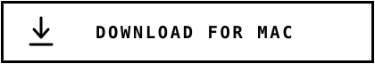
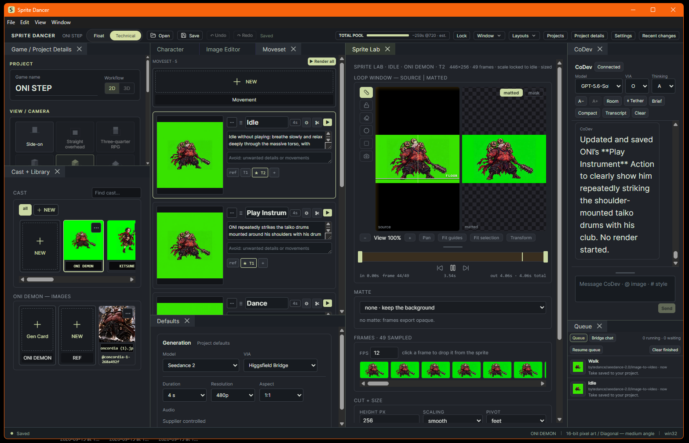
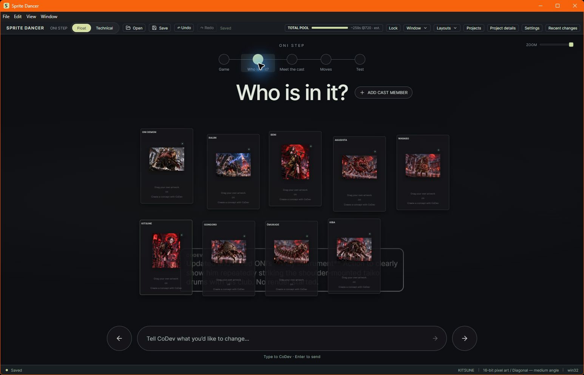
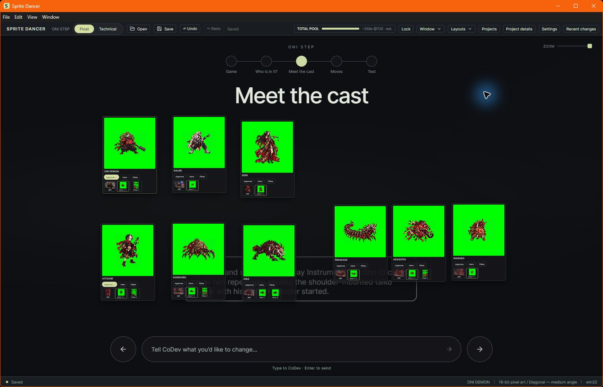
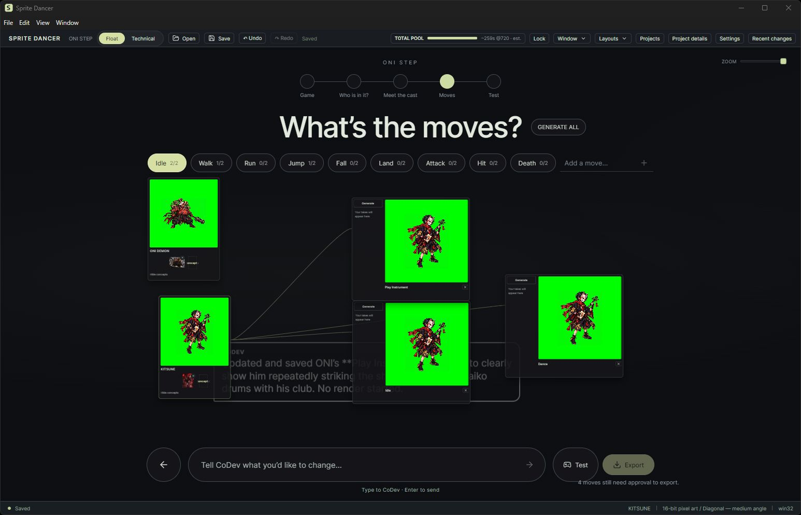
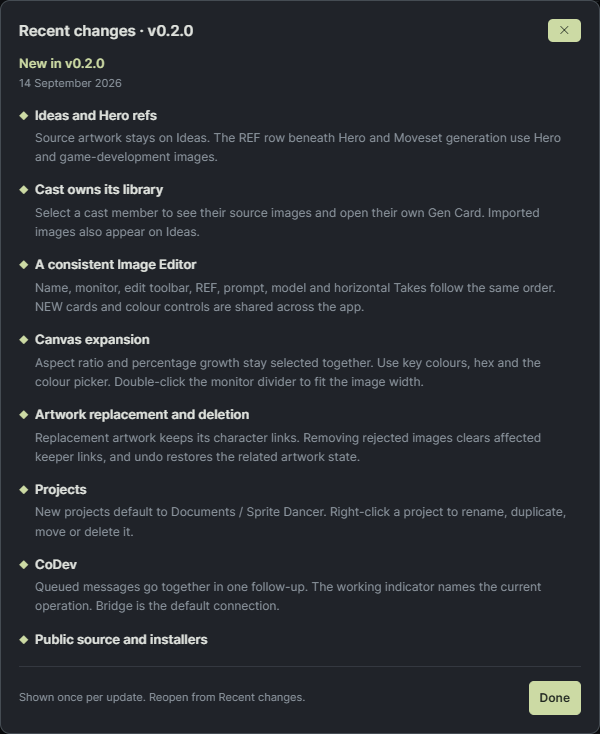

# Sprite Dancer

  <a href="https://github.com/koan-shdw/sprite-dancer-app/releases/latest/download/SpriteDancer-Windows-Setup.exe">
    <picture>
      <source media="(prefers-color-scheme: dark)" srcset=".github/buttons/download-windows-dark.svg">
      
    </picture>
  </a>
  &nbsp;&nbsp;
  <a href="https://github.com/koan-shdw/sprite-dancer-app/releases/latest/download/SpriteDancer-Mac.dmg">
    <picture>
      <source media="(prefers-color-scheme: dark)" srcset=".github/buttons/download-mac-dark.svg">
      
    </picture>
  </a>

### Create, animate and finish sprites for games.

Sprite Dancer is a tool we are building to become indispensable to artists creating sprites for games. It brings frontier image and video generation together with an AI co-developer, giving creative developers the ability to generate art at scale and build rich worlds with hundreds of unique characters.

Sprite Dancer is proprietary software. Projects and media stay on your disk; online generation uses your connected accounts or API keys.

[Apple Silicon Mac](https://github.com/koan-shdw/sprite-dancer-app/releases/latest/download/SpriteDancer-Mac.dmg) · [Intel Mac](https://github.com/koan-shdw/sprite-dancer-app/releases/latest/download/SpriteDancer-Mac-Intel.dmg) · [All releases](https://github.com/koan-shdw/sprite-dancer-app/releases)

---

## Float mode

Describe your game, add the cast and bring characters through hero review, moves and testing. Float and Technical edit the same project, so you can switch to detailed controls at any stage.

**Who is in it?** Add cast members and collect their concept artwork in floating cards.

**Meet the cast.** Review heroes and takes, choose the characters to continue, and add optional reference plates.

**Moves.** Select a character to see its connected move cards. Generate takes, preview animations and approve the takes you want to test or export.

## Cast + Library

Select a cast card to see its source images and open its own Gen Card. Imported artwork appears in the library and on Ideas in the Character sheet. Search the cast when the project has many characters. Use the shared NEW card to create items and open reference pickers.

## Character

Create the Hero from artwork on Ideas. The Character sheet opens on Hero when one exists. The REF row beneath Hero contains the game images used from that point onward.

- Select a Hero while preserving its earlier takes.
- Use MAKE PLATE to generate a turntable and extract reference views.
- Preview supporting images without changing the Hero.
- Double-click an image to edit it; double-click the monitor divider to fit its width.
- Ideas refs stay with Hero creation. Moveset prompts and renders use Hero and game-development references.

## Image Editor

The editor follows the working order: name, monitor, edit toolbar, REF, prompt, model, then Takes.

Expand the canvas with an aspect ratio and percentage growth that stay selected together. Choose a key colour, enter hex or double-click the custom swatch for the colour picker. Describe an edit and generate new takes. Follow branches horizontally while preserving the original image.

## Moveset and Sprite Lab

Give each move an Action and a starting image, then generate video takes with the selected supplier. Inputs keep their own take histories.

Finish the chosen take in Sprite Lab: trim frames, key or matte the background, align the character and set output dimensions. Export PNG sprite sheets with JSON timing and pivot data. The Game window previews the prepared frames.

## CoDev and connections

CoDev reads the current project, helps write prompts and operates the app's existing controls. Queued messages are combined into one follow-up after the active reply. Its working indicator names the current operation.

Bridge is the default connection. Connect a supported OpenAI, Higgsfield or Runway account, or select a supported API route. Availability and charges depend on the account and provider. Keys and supplier tokens stay outside project files in local app settings.

## Projects and workspace

New projects default to **Documents / Sprite Dancer** on Windows and macOS. Choose another location when needed. Right-click a project to rename, duplicate, move or delete it.

Dock and resize the tool windows, save layouts and keep each project's media together. Artwork deletion updates affected links; undo restores related state.

## Recent changes

Open **Recent changes** from the top bar. The current release appears first, with earlier changes below. The window appears once after an update, after the project dialog is dismissed.

## Download and install

| Platform | Download |
|---|---|
| Windows x64 | [Windows Setup](https://github.com/koan-shdw/sprite-dancer-app/releases/latest/download/SpriteDancer-Windows-Setup.exe) |
| macOS Apple Silicon | [Mac DMG](https://github.com/koan-shdw/sprite-dancer-app/releases/latest/download/SpriteDancer-Mac.dmg) |
| macOS Intel | [Intel Mac DMG](https://github.com/koan-shdw/sprite-dancer-app/releases/latest/download/SpriteDancer-Mac-Intel.dmg) |

**Windows:** run Setup and choose the installation location. **macOS:** open the DMG and drag Sprite Dancer to Applications.

These builds are not signed by a verified publisher. macOS builds use ad-hoc signing and are not notarized, so the operating system may require approval before opening them. Download updates from this repository; automatic updating is not included in this release.

  <a href="https://github.com/koan-shdw/sprite-dancer-app/releases/latest/download/SpriteDancer-Windows-Setup.exe">
    <picture>
      <source media="(prefers-color-scheme: dark)" srcset=".github/buttons/download-windows-dark.svg">
      
    </picture>
  </a>
  &nbsp;&nbsp;
  <a href="https://github.com/koan-shdw/sprite-dancer-app/releases/latest/download/SpriteDancer-Mac.dmg">
    <picture>
      <source media="(prefers-color-scheme: dark)" srcset=".github/buttons/download-mac-dark.svg">
      
    </picture>
  </a>

## License

Sprite Dancer is proprietary software. Source code is maintained privately. Model weights, third-party dependencies and hosted services retain their own licenses and terms.
